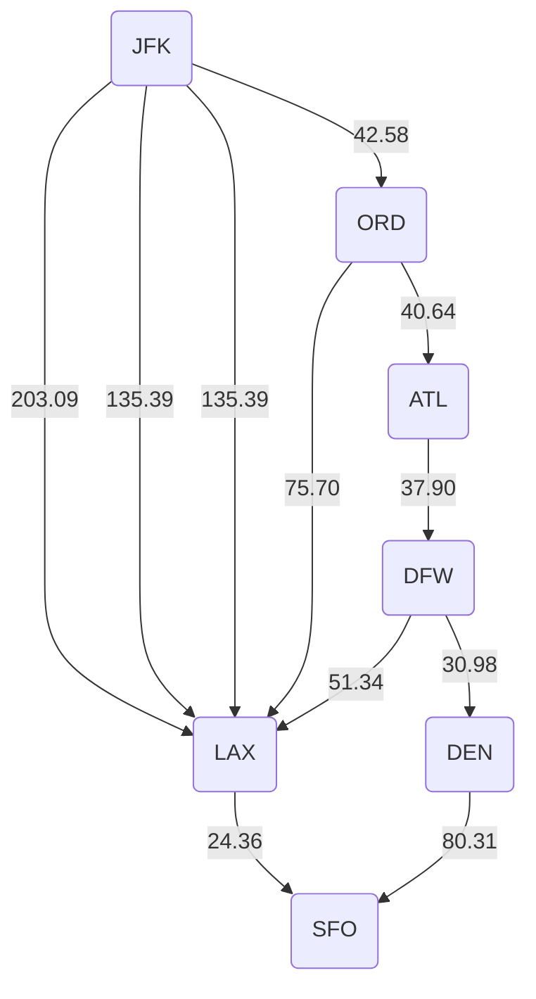
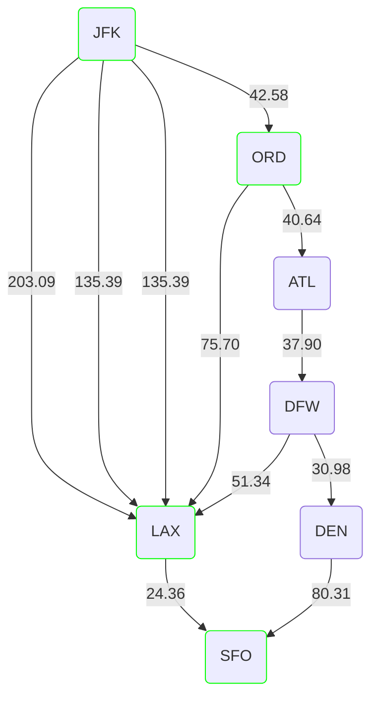

```mermaid
flowchart TD
```

```mermaid
flowchart TD
	JFK(JFK)
	LAX(LAX)
	ORD(ORD)
	ATL(ATL)
	DFW(DFW)
	DEN(DEN)
	SFO(SFO)
	JFK(JFK) -->|203.09| LAX(LAX)
	JFK(JFK) -->|135.39| LAX(LAX)
	JFK(JFK) -->|135.39| LAX(LAX)
	JFK(JFK) -->|42.58| ORD(ORD)
	ORD(ORD) -->|75.70| LAX(LAX)
	ORD(ORD) -->|40.64| ATL(ATL)
	ATL(ATL) -->|37.90| DFW(DFW)
	DFW(DFW) -->|51.34| LAX(LAX)
	DFW(DFW) -->|30.98| DEN(DEN)
	DEN(DEN) -->|80.31| SFO(SFO)
	LAX(LAX) -->|24.36| SFO(SFO)
```

```mermaid
flowchart TD
	JFK(JFK)
	LAX(LAX)
	ORD(ORD)
	ATL(ATL)
	DFW(DFW)
	DEN(DEN)
	SFO(SFO)
	JFK(JFK) -->|203.09| LAX(LAX)
	JFK(JFK) -->|135.39| LAX(LAX)
	JFK(JFK) -->|135.39| LAX(LAX)
	JFK(JFK) -->|42.58| ORD(ORD)
	ORD(ORD) -->|75.70| LAX(LAX)
	ORD(ORD) -->|40.64| ATL(ATL)
	ATL(ATL) -->|37.90| DFW(DFW)
	DFW(DFW) -->|51.34| LAX(LAX)
	DFW(DFW) -->|30.98| DEN(DEN)
	DEN(DEN) -->|80.31| SFO(SFO)
	LAX(LAX) -->|24.36| SFO(SFO)
	style JFK stroke:#0f0
	style ORD stroke:#0f0
	style LAX stroke:#0f0
	style SFO stroke:#0f0
```

